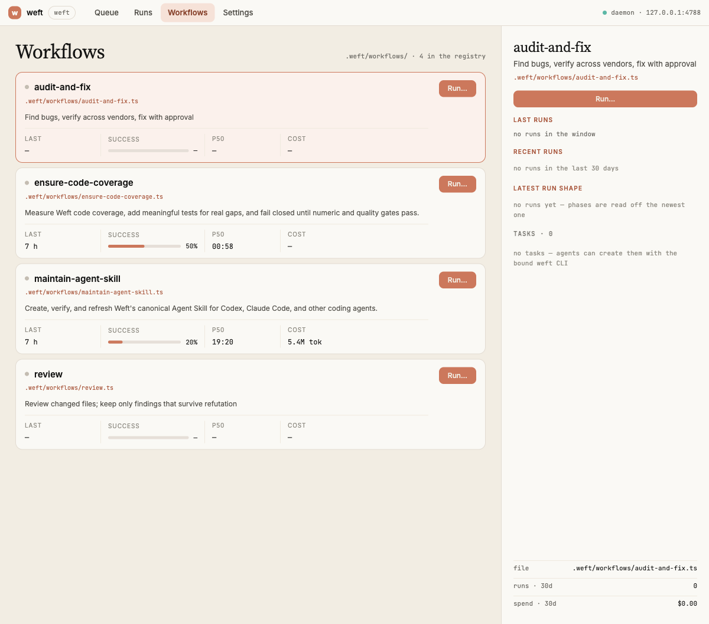
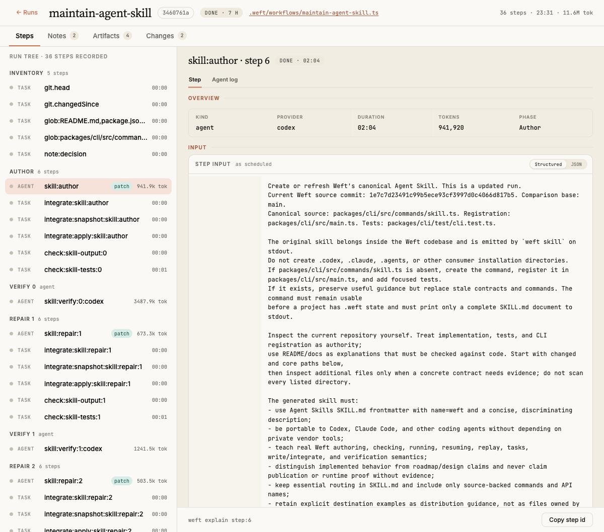

# Weft

Durable, journaled, schema-validated multi-agent coding workflows in TypeScript.

Weft runs multi-agent coding workflows you write as ordinary TypeScript programs. Every step — an agent
turn, a human answer, a shell command, an HTTP call, a git read — returns a schema-validated value, so the
plumbing between steps is typed rather than parsed. Every run is journaled to an append-only event log, so it survives a crash, a
reboot, or an overnight wait on a human, and resumes from the line it stopped on. The same script runs on
Claude (Agent SDK) or Codex (Codex SDK), from a terminal or from inside a Claude Code / Codex session over
MCP, and leaves behind two records of what happened: the mechanical journal and a generated report.

Status: design preview. See [Status and honest deviations](#status-and-honest-deviations).

## Why Weft

- **The graph is your code.** `await` is a sequential edge, `ctx.parallel` fans out and joins,
  `ctx.pipeline` runs independent lanes, `if` on a typed field is a conditional edge, `while` is a bounded
  loop. There is no separate graph DSL to keep in sync with the program.
- **Every step returns a schema-validated value.** `schema` is required on `agent`, `human.*`, and workflow
  I/O (`ctx.check` returns a fixed `{ status, evidence }`). Invalid output is repaired in the same session
  with the validation errors fed back, not thrown away. A `z.string()` field is still prose — the guarantee
  is that what flows *between* steps has a shape you declared, not that prose is gone. Steps that opt out
  say so: `onError: "null"` yields `T | null`, and `ctx.exec`/`bash`/`fetch` without a `schema` hand back
  the raw result.
- **Durable by journaled replay, and replay is edit-tolerant.** Side effects are journaled steps; resume
  re-executes your code and serves completed steps from the journal. Reordering steps is free, rewording a
  prompt re-runs that step and what depended on it, and a cache miss re-runs rather than lying. Identity is
  content plus `key`: give each call a distinct `key` when two of them could share a prompt and schema, or
  replay re-runs them rather than guess which journaled answer belongs to which.
- **Humans are steps.** `ctx.gate` and `ctx.human.ask/approve/review` suspend the run durably. The answer
  can arrive hours later from the CLI, the web UI, or the session that started the run, and it is validated
  like any other output. Auto-approvals by policy are still recorded.
- **The journal owns the diffs.** A write step runs in its own git worktree and returns a patch, not a
  mutated tree. Patches are scope-checked and merged only where the workflow says `ctx.integrate()`, so a
  resume on a fresh clone rebuilds the tree from the journal.
- **Providers, not a host, and real accounting.** Claude and Codex sit behind one `AgentProvider` interface
  with per-step provider/model/effort routing, so a cross-vendor panel is one option on one step. Tokens and
  USD come from provider usage and enforce hard ceilings shared with sub-workflows.
- **Two records, both generated; the engine is a library.** The mechanical journal and the semantic report
  (checks, ledger, remaining risk) are projections over the same events, and the CLI, MCP server, and daemon
  are thin shells over one `Engine` class.

## What ships today

- **Authoring and discovery.** Start from simple, review, or task-aware TypeScript templates with `weft new`,
  reject non-deterministic workflow code before it runs with `weft check`, and inspect every loadable workflow's
  input, output, task, routing, and UI contract with `weft workflow`.
- **Reliable fan-out and checks.** `ctx.parallel(items, mapper, { concurrency, errors })` and
  `ctx.pipeline(...).run({ concurrency, errors })` bound concurrent work while preserving lane order. Choose
  `ctx.successes()` for a recorded tolerant result or `ctx.all()` to fail after every lane settles; journal
  shell, callback, trusted-prior, and deliberately skipped checks through `ctx.check`.
- **Reusable composition without hidden effects.** `definePrompt`, `defineAgent`, `defineRecipe`, `defineCheck`,
  and `defineCheckSuite` separate prompt text, agent roles, orchestration recipes, and verification policy.
  Immutable `ctx.phase()` and `ctx.scope()` handles carry execution policy safely across concurrent lanes while
  nested effects and suite members remain independently inspectable.
- **Workflow-scoped durable work.** Task records carry lifecycle, dependencies, acceptance criteria, notes,
  provenance, and typed workflow extensions. `defineTaskContract` makes the stored schema, executable revision,
  migration, and default agent authority explicit.
- **Workflow-native React views.** Import a colocated `.ui.tsx` component for a custom human-input view or a
  read-only presentation. Weft compiles the browser asset separately, journals the immutable view and JSON props,
  and keeps final answer submission in host-owned controls.
- **Several ways to operate.** Use the CLI, local Workflow Manager, MCP server, or a generated repository skill
  for Codex and Claude Code. The manager provides queue, runs, workflow contracts, settings, live updates, and
  durable task views over the daemon API.
- **Testable without a model.** `@techery/weft-testing` runs real workflow code through the engine with fixtures,
  schema validation, journal assertions, and mock task-operation envelopes.

## Install

> Not on npm yet — the packages below are what the release workflow publishes, and the names
> are final. Until the first tag lands, use the [Quickstart](#quickstart) from a checkout.
> Delete this note when `v0.1.0` ships.

The CLI is `@techery/weft`; the binary it installs is `weft`.

```bash
npm i -g @techery/weft        # or: pnpm add -g @techery/weft · bun add -g @techery/weft
weft doctor                   # checks node, git, provider credentials, .weft/ layout
weft new review               # scaffold .weft/workflows/review/{main.ts,lib/,tests/,CHANGELOG.md}
```

Without installing anything:

```bash
npx @techery/weft doctor
```

To drive Weft from inside a Claude Code or Codex session, point its MCP config at the server
package — no global install needed:

```json
{ "mcpServers": { "weft": { "command": "npx", "args": ["-y", "@techery/weft-mcp"] } } }
```

To write workflows, or to embed the engine in your own program, install the libraries you need:

```bash
npm i @techery/weft-sdk                        # defineWorkflow, ctx types, z
npm i -D @techery/weft-testing                 # runWorkflow harness + mock fixtures
npm i @techery/weft-core @techery/weft-host    # the Engine itself
```

Node 22.12 or newer. Every package is ESM-only and ships compiled JavaScript with type
declarations, so no loader or bundler is required.

To give a coding agent the complete authoring contract in a repository-local skill, generate it from the same
CLI version that will run the workflows:

```bash
mkdir -p .agents/skills/weft
weft skill > .agents/skills/weft/SKILL.md  # Codex

mkdir -p .claude/skills/weft
weft skill > .claude/skills/weft/SKILL.md  # Claude Code
```

## Quickstart

In a checkout of this repository:

```bash
pnpm install
pnpm typecheck && pnpm test

# this repo ships packaged review and audit-and-fix workflows — run them with the CLI
node packages/cli/bin/weft.js check review                    # tsc + gate
node packages/cli/bin/weft.js run review --base main --watch  # input fields become flags
node packages/cli/bin/weft.js ui                              # localhost: runs, live tree, report, answer
node packages/cli/bin/weft.js workflow list                   # loadable definitions and rejected files
node packages/cli/bin/weft.js workflow inspect review --json  # exact executable contract

# Keep state in this repo while also registering workflows from other folders
node packages/cli/bin/weft.js \
  --extra-workflow-dir examples/08-task-backed-code-review/task-backed-code-review \
  --extra-workflow-dir examples/09-custom-react-ui/custom-react-ui ui

# scaffold a simple, review, or task-aware workflow; nothing is overwritten
node packages/cli/bin/weft.js new triage --template simple
node packages/cli/bin/weft.js new recurring-review --template review
node packages/cli/bin/weft.js new issue-queue --template task

# or put `weft` on your PATH for this checkout
pnpm install:global
```

`pnpm install:global` registers this checkout's CLI as the global `weft` command. Run it again
after switching to a different checkout or pulling CLI changes you want to use locally.

## Workflow manager preview

The local workflow manager’s workflow view shows the registry and an internal inspector for each workflow.
These screenshots were captured from the active app at `http://127.0.0.1:4788/workflows`.

### Workflow list



### Specific workflow run



`bin/weft.js` asks the manifest which shape this package is in: a published install's
`exports` point at `dist/`, so it loads the compiled ESM; a checkout's point at `src/*.ts`,
so it registers tsx and loads the sources. The CLI therefore works straight after
`pnpm install`, and `pnpm build` does *not* change what it runs — a checkout keeps loading
`src/` even with `dist/` present, because its dependencies are still TypeScript and the
sources are the only coherent thing to load.

The engine is also usable directly as a library — no CLI, no filesystem, no models:

```bash
npx tsx examples/01-engine-as-a-library/main.ts
```

That example builds an `Engine` over in-memory stores and the mock provider, runs an inline workflow, and
prints the `report.md` projection it produced. It is the same assembly the CLI performs, with the fs stores
and a real vendor adapter swapped in. Six more runnable tours live alongside it — durable human gates,
write-step patches and scopes, edit-tolerant resume, sub-workflow budgets, the stdlib patterns, and the
testing harness. Start at [`examples/README.md`](./examples/README.md).

For the complete workflow authoring surface, including the logic and usage patterns behind every `ctx`
method, see the [workflow `ctx` reference](./docs/workflow-context-reference.md).

## A workflow, annotated

`.weft/workflows/review/main.ts` — review the files changed since a base ref, have Claude find bugs, have Codex
try to refute each one, return only what survived:

```ts
import { defineWorkflow, z } from "@techery/weft-sdk";
import { Finding, Verdict } from "./lib/schemas.ts"; // relative imports are bundled and hashed with the script

export default defineWorkflow(
  {
    id: "review",                                               // stable durable task namespace
    // `name` derives from the package directory: "review".
    description: "Review changed files; keep only findings that survive refutation",
    input: z.object({ base: z.string().default("main") }),      // --base main; the engine validates it
    output: z.object({ confirmed: z.array(Finding) }),          // and validates the result on the way out
    tasks: {
      extensions: z.object({ ownerTeam: z.string() }),          // optional typed task-specific context
      semanticRevision: "owner-team-v1",                       // bump when its executable behavior changes
    },
  },
  async (ctx, { base }) => {
    ctx.phase("Scope");                                          // phases group steps in the live tree
    const { files } = await ctx.git.changedSince(base);          // [{ path, status }] · journaled, replayed
    const paths = files.filter((f) => f.status !== "D").map((f) => f.path);

    ctx.phase("Find");
    const found = ctx.all(                                       // every lane must succeed
      await ctx.parallel(                                        // bounded, in input order
        paths,
        (f) =>
          ctx.agent(`Review ${f} for correctness bugs. Cite file:line and quote the evidence.`, {
            schema: z.object({ findings: z.array(Finding) }),     // required on every step
            key: `review:${f}`,                                  // stable identity for replay, tests, the tree
          }),
        { concurrency: 4, errors: "throw" },
      ),
    );
    const findings = found.flatMap((r) => r.findings);           // typed — no nulls to filter

    ctx.phase("Verify");
    const confirmed = ctx.all(
      await ctx
        .pipeline(findings)                                      // independent lanes, no barrier between stages
        .step((f) =>
          ctx.agent(`Try to refute: ${f.claim} (${f.file}:${f.line}). Default real=false if unsure.`, {
            schema: Verdict,
            provider: "codex",                                   // a different vendor grades
            key: `refute:${f.file}:${f.line}`,
          }),
        )
        .filter((verdict) => verdict.real)                       // a falsy verdict drops the lane
        .map((_verdict, f) => f)                                 // back to the finding
        .run({ concurrency: 4, errors: "throw" }),
    );

    return { confirmed };
  },
);
```

`.weft/workflows/audit-and-fix/main.ts` takes the same shape further: a cross-vendor refutation panel, an
approval gate, parallel fixes in isolated worktrees with declared write scopes, an explicit sequential
merge, and a required `pnpm test` check that gates the run's completion.

## How it works

Everything that leaves the sandbox is a step. The engine executes it, appends the outcome to an append-only
journal, and hands the workflow a validated value. Workflow task records live under `.weft/tasks/` so every
run of a workflow shares them. Agent-requested task mutations travel inside the validated step result, are
journaled with that step, and are applied idempotently by the engine only after the step succeeds.

Resume re-executes your code from the top and serves completed steps out of the journal, so the process can
die between any two of them. Replay is edit-tolerant: a step is reused when its inputs still hash the same
(sequence fast path, then content-addressed salvage, then a live call), and `weft replay --dry` prints
hits, salvaged, and diverged before a single model is called.

Humans sit in the graph rather than beside it. `ctx.gate` and `ctx.human.*` suspend the run durably; the
answer arrives from `weft answer`, the web UI, or the calling session, and is schema-validated on the way in.

Write steps do not mutate the tree. An agent with a declared `write:` scope gets its own git worktree, its
diff is captured as a patch blob, out-of-scope files are flagged (or the patch quarantined), and nothing
lands until the workflow calls `ctx.integrate()`. A run that ends with un-integrated patches fails.

```text
.weft/runs/<id>/
  journal.jsonl     # the truth — every step, request, answer, patch (secrets redacted)
  script.ts         # what ran, bundled (+ source map, so errors point at your .ts lines)
  blobs/<hash>      # patches, transcripts, large step outputs
  state.json        # projection: status, steps, scopes, checks
  tree.json         # projection: the live tree the UIs render
  report.md         # projection: outcome, changes, checks, ledger, remaining risk
```

Only `journal.jsonl` has to survive; every other file in that directory is rebuilt from it.

## Workflow task context

Every task-aware agent step receives a bounded task snapshot plus the workflow-bound CLI prefix for a human
operator running at the repository root:

```bash
weft task --workflow review --json list
```

Providers return desired changes in the structured `taskOperations` result field; they never receive direct
storage authority and must not invoke the CLI themselves, so retries and replay cannot duplicate notes or
creates. People use the same workflow-bound CLI (`schema`, filtered `list`, `show`, `create`, semantic `upsert`,
`update`, `note`, `accept`, `unaccept`, and guarded `remove --yes`).

Workflow authors control the context and authority per step. `tasks: false` removes task context,
`tasks: { mode: "read", relatedFiles: [file], tags: ["code-review"] }` injects only relevant history and
rejects mutations, and write mode allows validated operations. Workflow-owned `ctx.tasks.observe`, `upsert`,
`update`, `note`, and `setCriterion` are journaled steps. Observations therefore remain replay-stable across a
suspension, while mutations settle through the same idempotent engine boundary as agent-requested operations.
`upsert` uses a workflow-scoped semantic `dedupeKey`, which is useful for recurring findings whose line numbers
or wording can change between runs.

Tasks carry a title, description, status (`todo`, `in_progress`, `blocked`, `done`, `cancelled`), priority,
tags, dependencies, related files, stable-ID acceptance criteria, append-only notes, actor/timestamps, and a
revision. Writes may use optimistic `--if-revision` guards. Mutations are serialized per workflow so parallel
steps cannot lose notes or race dependency edits. A batch is preflighted as a unit and each operation carries a
durable idempotency key: a crash can expose an applied prefix, but replay skips that prefix and converges the
remaining operations without duplicating them. Set `meta.id` once to keep the task namespace stable across
file/name changes. A workflow may declare `tasks.extensions`; that Standard Schema validates workflow-specific
context while the core fields remain stable. It must also declare a `tasks.semanticRevision`: keep it stable for
display-name and unrelated workflow edits, and change it whenever validation, defaults, refinements, transforms,
or migration behavior changes. When the persisted representation changes, also increment `tasks.schemaVersion`
and provide `tasks.migrate(value, fromVersion)`. Each run remains bound to its exact executable task contract,
and migrated values are persisted on the next mutation. The workflow manager renders all tasks from
`GET /api/workflows/:name/tasks`.

`defineTaskContract({ schema, revision, version?, agentAccess?, migrate? })` is the concise form for declaring
that contract. Task-enabled workflows require a stable `meta.id`; agent steps receive read-only task context by
default. Set `agentAccess: "write"` only when the workflow's default should permit structured task mutations,
or opt a single agent step into write access.

See [`examples/08-task-backed-code-review`](./examples/08-task-backed-code-review) for the recommended review
shape: typed same-run claims, a consolidation pass, independent refutation, human selection, then durable task
upserts with first/last-seen provenance and occurrence notes.

## Custom React views in workflows

Keep a `.ui.tsx` file next to the workflow and import it directly. An input view, created with
`defineUiView` from `@techery/weft-sdk/ui`, is passed to `ctx.human.ask({ ui: { view, props } })`; it can only
stage a candidate answer. The Workflow Manager validates that candidate and a person uses its **Submit and
resume** control to record the durable answer. A display view, created with `defineResultView`, is published as
its own replay-aware step with `ctx.ui.render({ key, slot?, view, props })`.

View props and proposed answers are JSON-only and bounded; code and props are persisted separately from the
workflow's Node bundle. The manager renders a presentation alongside the ordinary schema/result data, so a
custom component is never the source of truth. See the [custom UI guide](./docs/custom-react-ui-in-workflows.md)
and the runnable [`examples/09-custom-react-ui`](./examples/09-custom-react-ui).

## Packages

| Package | Owns |
| --- | --- |
| `@techery/weft-sdk` | `defineWorkflow`, the `ctx` types, the Zod re-export. Zero runtime deps beyond Zod. |
| `@techery/weft-core` | Scheduler, replayer, journal model, budget, HITL broker, projections. No SDK imports. |
| `@techery/weft-gate` | TS parse, the AST rule set (clock, randomness, timers, network, env, imports, GC and locale globals), esbuild bundling, the sandboxed loader. |
| `@techery/weft-store-fs`, `@techery/weft-index-sqlite` | JournalStore and BlobStore on the filesystem; an optional derived `node:sqlite` run index. |
| `@techery/weft-provider-claude`, `@techery/weft-provider-codex`, `@techery/weft-provider-mock` | `AgentProvider` adapters behind a shared conformance suite (structured output, repair, scope, abort, usage). |
| `@techery/weft-git` | `ctx.git.*`: typed read/write git operations with fixed risk tiers. |
| `@techery/weft-isolation` | Worktrees, patch capture, scope checks. (Merge and conflict handling live with `ctx.integrate` in `@techery/weft-core`.) |
| `@techery/weft-stdlib` | Typed patterns: `adversarialVerify`, `judgePanel`, `loopUntilDry`, `integrationLedger`, `finalReport`, … |
| `@techery/weft-testing` | `runWorkflow` harness, mock fixtures, journal assertions, store conformance suites. |
| `@techery/weft-design-system` | React primitives, tokens, and theme used by the Workflow Manager and optional custom workflow views. |
| `@techery/weft-host` | Engine assembly shared by the hosts: config loading, stores, providers, workflow registry. |
| `@techery/weft`, `@techery/weft-mcp`, `@techery/weft-daemon` | Hosts. CLI: run, resume, task, workflow, ls, status, answer, cancel, report, replay, check, explain, diff, new, skill, ui, doctor. MCP: `weft.run/wait/answer/resume/list/report/types`. Daemon: serves the web UI and wakes suspended runs. |

## Apps

| App | Owns |
| --- | --- |
| `@techery/weft-ui` (`apps/ui`) | The workflow manager: queue, runs, run detail, workflows, settings, a ⌘K launcher, durable tasks, schema-result inspection, and custom workflow presentations — reading and writing the live journal through the API below. React + Vite + TanStack Router + Query + Jotai, laid out atomically. See [apps/ui/README.md](./apps/ui/README.md). |

`weft ui` serves it. The manager builds into `packages/daemon/web/`, and the daemon that
`weft ui` starts serves that directory at `/` — so `pnpm build && weft ui` opens the
manager, and its client-side routes (`/runs/r-045?tab=changes`) survive a reload.

The daemon's HTTP surface is what it reads from:

| | |
| --- | --- |
| `GET /api/meta` | repo, version, resolved defaults, limits, approval tiers, wired providers |
| `GET /api/pending` | every question waiting on a person, across every run, oldest first — plus any journal it could not read, rather than an empty list |
| `GET /api/workflows` · `/:name` · `/:name/stats` · `/:name/tasks` | registry and schemas; 30-day stats; durable workflow tasks |
| `POST /api/runs` | start a registry workflow — name, input, `budget`, `reuse` |
| `GET /api/runs` | the journal index; `?spend=1` adds tokens, dollars and step counts |
| `GET /api/runs/:id` · `/report` · `/tree` · `/pending` · `/events` | one run: state, report, tree, its questions, and the journal as SSE |
| `GET /api/runs/:id/artifacts` · `/patch` | what a run wrote; the unified diff with per-file `+/−` counts |
| `POST /api/runs` refuses | a path (registry names only), an input field the schema would drop, and a budget with a misspelled axis |
| `GET /api/blobs/:ref` | the bytes behind a journaled ref, cached immutably |
| `GET` · `PUT /api/config` | `.weft/config.json`, validated before it is written |
| `POST /api/runs/:id/answer` · `/signal` · `/cancel` · `/resume` | act on a run |

```bash
pnpm build && node packages/cli/bin/weft.js ui   # or `weft ui` with weft on your PATH
```

To work on the UI itself, run both: the daemon does the work, and Vite serves the page
and proxies its API calls there — so a component can be edited while a run is mid-flight.

```bash
weft ui        # terminal 1 — a daemon on :4781
pnpm dev:ui    # terminal 2 — the UI on :4782, hot-reloading against it
```

Open **http://localhost:4782** (Vite binds `[::1]`, the daemon binds `127.0.0.1`; the
proxy bridges them). `WEFT_DAEMON=http://127.0.0.1:4790 pnpm dev:ui` points it elsewhere.

A checkout that has not built the manager still gets a working UI: the daemon falls back
to its own built-in page, and `weft ui` says which one you are looking at. That page reads
the live journal and keeps a fixed address at `/legacy` either way.

## Contributing

Development setup, focused and release-grade validation, workflow/custom-UI conventions, and documentation
expectations now live in [CONTRIBUTING.md](./CONTRIBUTING.md). The contributor guide is the source of truth for
changing Weft; [RELEASING.md](./RELEASING.md) covers publishing a validated release.

## Testing workflows

Workflow tests run with zero model calls. Fixtures match on the step key, receive the real request, and go
through the engine's normal schema validation — a fixture that would not pass in production fails the test.

Keep tests inside each workflow package's `tests/` directory and run them with:

```sh
weft test
weft test .weft/workflows/review/tests/main.test.ts
weft test --runner node
weft test --watch
weft test --coverage
```

With no pattern, `weft test` runs `.weft/workflows/*/tests/**/*.test.ts` with Node's built-in
`node:test` runner. Explicit patterns use locally installed Vitest when available, Bun's native runner for a
Bun project, and otherwise Node. It never installs dependencies implicitly. Use `--runner node`,
`--runner bun`, or `--runner vitest` to select a runner explicitly. Use `weft check` separately to validate
workflow source and schemas.

Node-runner tests use Node's built-in APIs, so they do not import Vitest:

```ts
import assert from "node:assert/strict";
import { test } from "node:test";
```

```ts
import { mock, runWorkflow } from "@techery/weft-testing";
import review from "../.weft/workflows/review/main.ts";

test("keeps only findings that survive refutation", async () => {
  const { output, journal } = await runWorkflow(review, {
    input: { base: "main" },
    provider: mock()
      .on({ key: "review:*" }, () => ({
        findings: [{ file: "a.ts", line: 3, claim: "off-by-one", evidence: "for (i <= n)" }],
      }))
      .on({ key: "refute:*" }, (req) => ({ real: req.prompt.includes("off-by-one"), reason: "loop bound" })),
    git: { changedSince: { files: [{ path: "a.ts", status: "M" }] } },
  });

  expect(output.confirmed).toHaveLength(1);
  expect(journal.steps({ kind: "agent" })).toHaveLength(2);
  expect(journal.step("refute:a.ts:3").prompt).toContain("Default real=false");
});
```

`runWorkflow` also takes `exec`, `bash`, `fetch`, `env`, and `answers` fixtures, so a workflow with human
steps and shell checks runs end to end in a unit test.

Ordinary mock values are always treated as the workflow result, even when their domain schema contains fields
named `result` and `taskOperations`. To exercise agent-requested tracker mutations explicitly, wrap the fixture
with `mockTaskEnvelope(result, operations)` from `@techery/weft-testing`.

## Status and honest deviations

This repository implements the design in the two design documents. Where it does not, it says so:

1. **The sandbox is `node:vm` with replaced globals, not `worker_threads`.** The design calls for a worker
   thread; the loader currently evaluates the bundled script in a `vm` context whose globals are replaced.
   Either way it is a determinism fence, not a security boundary — workflow scripts are our own agents'. The
   upgrade path (worker thread, or `isolated-vm` if untrusted scripts ever appear) is behind the same seam.
   The fence is two-layered by design: the AST rules reject the named form at parse time with a fix-it, and
   the replaced globals stop the computed form (`globalThis["Da" + "te"]`) at run time. The AST half is
   syntactic and evadable on purpose — it is the cheap early warning, not the boundary.
2. **The Claude adapter uses the terminating `structured_output` tool only.** Native JSON mode is not wired
   up yet, so every Claude step pays for the SDK-MCP tool round trip even when its schema would fit the
   native path. The schema lint that flags what the native path would reject exists; the native branch does
   not.
3. **The built web UI is a Vite + React app served by the daemon.** `apps/ui` builds the workflow manager
   into `packages/daemon/web/`, and `weft ui` serves that bundle with client-side routes, API-backed views,
   live journal updates over SSE, and journaled custom workflow presentations. A fresh checkout that has not run
   `pnpm build` uses the daemon's single-file built-in fallback instead; that legacy surface remains available at
   `/legacy`.
4. **TypeScript is pinned to 5.9.** The gate needs the in-process compiler API to parse workflow scripts and
   apply its AST rules; the native 7.x compiler does not expose it yet. Unpinning waits on that API.
5. **Replay identity is content plus `key`, and the world is not in it.** A step's identity hashes its
   kind, payload, schema, and `key`. What the step could *read* — the working tree an agent greps — is not
   hashed, which is the trade edit-tolerant replay makes for not forcing you to version every change. Two
   guards narrow it: a keyless step whose content matches several journaled entries re-runs instead of
   guessing, and a resume compares a hash of the workflow body so step positions are only trusted when the
   script did not change. Declared read scopes (`reads:`), which would put the tree hash in the key, are not
   built.
6. **OpenTelemetry spans cover runs, not steps.** One span per run, with the run id as the trace id. The
   per-step spans the design describes are not emitted yet, so step-level latency has to come from the
   journal.

## License

MIT
