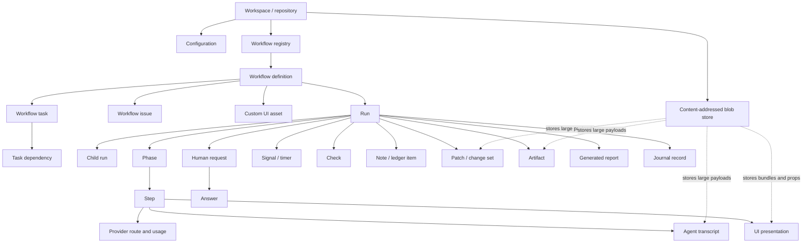

# Weft Information Architecture

**Audience:** Product design, UX research, content design, product management, and engineering
**Purpose:** Provide a standalone product and information-architecture specification for designing the Weft user experience.
**Product snapshot:** 27 August 2026
**Status:** Design handoff; combines the current product model with recommended information architecture. No repository access or prior knowledge of Weft is required to use this document.

## Contents

1. [Executive summary](#1-executive-summary)
2. [How to read this document](#2-how-to-read-this-document)
3. [Product boundary](#3-product-boundary)
4. [Human roles and automated actors](#4-human-roles-and-automated-actors)
5. [Conceptual object model](#5-conceptual-object-model)
6. [Source of truth and information trust](#6-source-of-truth-and-information-trust)
7. [Entity catalog](#7-entity-catalog)
8. [Lifecycle and status vocabulary](#8-lifecycle-and-status-vocabulary)
9. [Recommended navigation and hierarchy](#9-recommended-navigation-and-hierarchy)
10. [Screen-level information requirements](#10-screen-level-information-requirements)
11. [Core user flows](#11-core-user-flows)
12. [Action and channel matrix](#12-action-and-channel-matrix)
13. [Design rules and edge cases](#13-design-rules-and-edge-cases)
14. [Known IA and product-contract gaps](#14-known-ia-and-product-contract-gaps)
15. [Delivery priorities](#15-delivery-priorities)
16. [Open product decisions](#16-open-product-decisions-for-design-kickoff)
17. [Design handoff checklist](#17-design-handoff-checklist)
18. [Worked design scenarios](#18-worked-design-scenarios)
19. [IA acceptance criteria](#19-information-architecture-acceptance-criteria)
20. [Suggested design deliverables](#20-suggested-design-deliverables)
21. [Standalone reference summary](#21-standalone-reference-summary)

## 1. Executive summary

Weft is a local, repository-scoped control plane for durable multi-agent workflows. A workflow is a typed TypeScript program. Running it creates a durable, journaled execution that may call agents and tools, create isolated changes, wait for a person or an external signal, run checks, and produce outputs and evidence.

The UI should help users answer four questions:

1. **What can I run?** Discover a workflow, understand its contract, provide valid input, and start it.
2. **What needs attention?** See running work, human decisions, external waits, failures, and storage or configuration problems.
3. **What happened?** Understand a run's outcome, execution, changes, evidence, cost, and provenance without reading the raw journal first.
4. **What context carries forward?** Inspect and maintain workflow-scoped tasks that persist independently of an individual run.

These questions map to four product areas:

| Area | Primary objects | Primary user goal |
| --- | --- | --- |
| Define | Workflow, contract, UI asset, workflow issue | Understand and author executable capabilities |
| Operate | Queue, run, human request, signal | Start work and keep it moving |
| Understand | Step, phase, change, check, artifact, report, journal | Review outcomes, evidence, and provenance |
| Configure | Workspace, providers, policies, limits, runtime status | Control how work executes |

The recommended top-level navigation is **Queue**, **Runs**, **Workflows**, and **Settings**, with a persistent global workflow launcher. Tasks belong inside a workflow rather than in a generic project-management area because their namespace, schema, and agent permissions are workflow-defined.

The recommended run detail architecture is **Overview**, **Execution**, **Changes**, and **Outputs**. The journal remains available as an advanced evidence view, not the default way to understand a run.

### 1.1 Product story in one example

Imagine a workflow named **Review pull request**. A user launches it with a repository path and pull-request number. Weft validates that input, starts a durable run, asks two agents to review in parallel, captures their outputs, runs checks, and creates an isolated patch. The run then pauses with a high-risk approval question: “Apply these changes?”

The reviewer opens Queue, sees why the decision is needed, inspects the effective diff and checks, and approves. The workflow applies the patch, verifies the result, records a typed output, and completes. Days later, an auditor can still inspect exactly which workflow version ran, which model handled each agent step, what the user approved, which changes were merged, and which evidence supported the outcome. A workflow-scoped task such as “Investigate flaky integration test” remains available to future runs.

This example contains the complete Weft mental model:

```text
Workflow definition
  + validated launch input
  → durable run
  → phases and steps
  → human or external waits
  → changes, checks, notes, artifacts, and output
  → completed or recoverable history

Workflow task context
  → persists across runs of the same workflow
```

### 1.2 Design north star

The UI should make automation **legible before it is powerful**. At every consequential moment, a user should be able to tell:

- what is happening;
- why it is happening;
- what evidence supports it;
- what action is available;
- what that action will change;
- whether the displayed information is recorded fact, derived summary, or unavailable.

## 2. How to read this document

The document distinguishes three levels of product availability:

- **Current UI:** represented and actionable in the web Workflow Manager today.
- **Platform available:** exists in the journal, storage model, daemon API, CLI, MCP, or workflow runtime, but is absent or incomplete in the web UI.
- **Proposed UI:** a design recommendation. It may require a new or expanded product contract.

This distinction matters. A UI concept should not be designed as if its data exists merely because it would be useful. In particular, Weft does not currently record a reliable future plan, percentage complete, structured tool-call list, owner, or schedule.

### 2.1 Assumptions for the first designed product

Unless a later product decision changes them, design should assume:

- Weft runs on a developer's machine against one currently selected repository/workspace.
- The Workflow Manager is a desktop-first local web application.
- One human is operating the local instance; role labels describe intentions rather than separate permissions.
- Workflows may be long-running and may survive UI closure or daemon restart.
- A run can create child runs and can pause for multiple human requests over its lifetime.
- A workflow may be loaded, broken, or loaded with warnings.
- A completed run is evidence, not disposable activity feed content.
- A cancelled run is retained and may be resumable.
- Technical data can be large. The interface needs summaries and progressive disclosure rather than arbitrary truncation without explanation.
- Custom workflow UI is optional. Every critical interaction must still have a host-owned, schema-based fallback.

### 2.2 Glossary

| Term | Plain-language definition | What it is not |
| --- | --- | --- |
| Workspace | The local repository and Weft data/configuration context currently being operated | A hosted organization or account |
| Workflow | Versioned executable instructions with typed input/output and optional task/UI contracts | A single run or static checklist |
| Workflow registry | The set of discovered workflow definitions, including files that failed to load | A marketplace |
| Contract | The schemas, defaults, stable identity, task rules, and UI assets declared by a workflow | A prose-only description |
| Run | One durable execution of a workflow with a unique ID and journal | A reusable workflow definition |
| Root run | The top-level run started by the user | Necessarily the owner of every child request |
| Child run | A subworkflow execution created by another run | A UI-only grouping |
| Phase | A workflow-authored label grouping observed work | A guaranteed plan or percentage-complete segment |
| Step | One observed unit of execution, such as agent work, a check, shell command, gate, or subworkflow | Always a direct user action |
| Attempt | One execution attempt for a step | A new logical step |
| Human request or gate | A durable question that pauses a run for human input, approval, review, or confirmation | A transient modal that can be dismissed without consequence |
| Signal | Named external input that can resume a waiting run | A human notification |
| Check | Recorded verification result and supporting evidence | A generic status label |
| Note | A journaled decision, claim, or risk emitted by the workflow | An editable collaborative comment thread |
| Patch | A captured set of file changes produced in isolation | Automatically applied changes |
| Effective diff | The cumulative changes that currently affect the run's outcome | Every patch ever captured, including discarded patches |
| Artifact | A durable referenced output such as a file, data payload, or generated asset | Always previewable in the browser |
| Blob | Content-addressed storage for a large payload referenced from durable records | A user-facing business object by itself |
| Presentation | A custom workflow-rendered input or display view backed by recorded JSON props | The canonical output or approval authority |
| Transcript | Recorded agent-session conversation or stream data for a step | A guaranteed structured tool-call log |
| Route | The provider, model, and effort selected for an agent step | A navigation route |
| Usage | Recorded tokens, spend, and related provider consumption | A complete budget ratio when no ceiling exists |
| Journal | Append-only ordered record of what occurred in a run | The default human-readable run summary |
| Projection | Current state or report derived from the journal | A separate source of truth |
| Task | Workflow-scoped context that persists across multiple runs | A generic team task or issue with an assignee |
| Replay | Re-execution that reuses durable history when identity and semantics permit | A blind restart from the beginning |
| Resume | Continue a paused, failed, or cancelled durable run | Create an unrelated new run |
| Scope violation | A recorded change outside the workflow's allowed file scope | Necessarily a successful security boundary |

## 3. Product boundary

### 3.1 What Weft is

Weft currently operates within one local workspace and daemon context. It provides:

- typed workflow discovery and inspection;
- durable run execution and resume;
- human gates and custom workflow UI;
- agent, shell, file, Git, fetch, check, signal, timer, and subworkflow steps;
- isolated patch capture and explicit workflow-controlled integration;
- workflow-scoped durable tasks;
- append-only execution history and derived reports;
- provider routing, usage, budget, concurrency, and approval configuration.

### 3.2 What Weft is not yet

The current model does not define:

- user accounts, organizations, teams, or role-based access control;
- workflow owners, assignees, or schedules;
- hosted collaboration, comments, notifications, or subscriptions;
- a generic project or ticket system;
- a stable future run plan from which percentage complete can be calculated;
- a security boundary for executing untrusted workflow code.

Designs may leave room for those capabilities, but must not make them part of the current user promise.

## 4. Human roles and automated actors

One person may perform all human roles in a local installation. These are task-oriented roles, not current account types.

| Role | Questions they ask | Important actions |
| --- | --- | --- |
| Workflow author | Is this workflow valid? What input, output, task, and UI contracts does it expose? | Scaffold, edit, check, inspect, test |
| Operator | What can I start? What is active or blocked? | Launch, monitor, cancel, resume, deliver input |
| Reviewer or approver | What decision is required, with what risk and evidence? | Answer, approve, reject, review an artifact |
| Auditor or debugger | Why did this happen? What model, input, output, patch, or check was involved? | Inspect, compare, report, dry replay, trace journal events |

Automated actors are also visible in provenance:

- **Workflow runtime:** schedules steps and owns execution semantics.
- **Agent/provider:** produces agent outputs and may request bounded task operations.
- **Tool or effect handler:** performs file, shell, Git, fetch, environment, timer, or side-effect operations.
- **External system:** delivers a named signal.

## 5. Conceptual object model



Key relationship rules:

- A workflow has a display name and may have a stable metadata ID. The stable ID owns the task namespace even if the display name changes.
- A run belongs to one workflow and can create child runs for subworkflows.
- A step belongs to a run and may be grouped under a phase or parent step.
- A human request belongs to the run that created it. Queue views may group it under a root run, but answers must be sent to the owning run.
- A task belongs to one workflow. Task dependencies cannot cross workflow namespaces.
- Large payloads are referenced by content hash. The reference remains evidence even if the local blob is unavailable.

## 6. Source of truth and information trust

Weft deliberately separates recorded truth from convenient projections. The UI must preserve this distinction.

| Information source | Authority | UI use |
| --- | --- | --- |
| `journal.jsonl` | Append-only source of truth for a run | Provenance, advanced inspection, rebuilding projections |
| `state.json`, `tree.json`, `report.md` | Derived run projections | Fast operational views and human-readable reporting |
| Workflow source and built script | Executable workflow contract | Registry, input/output schema, defaults, replay identity |
| `.weft/tasks` | Durable workflow-scoped task source | Cross-run context, criteria, dependencies, notes |
| `.weft/blobs` | Content-addressed large payloads | Patches, artifacts, transcripts, custom UI bundles and props |
| `.weft/config.json` | Desired configuration on disk | Settings editor |
| Daemon effective configuration | Configuration actually used by the running process | Runtime status; may differ until restart |
| SQLite run index | Rebuildable index, not canonical truth | Search and list acceleration |

### 6.1 Three information classes

**Recorded facts** may be shown directly:

- run, step, and human-request states and timestamps;
- route, provider, model, effort, token usage, and spend samples;
- schemas, inputs, outputs, errors, checks, notes, logs, and drops;
- patch capture, merge, discard, conflict, and scope-violation events;
- human answers and actors;
- custom UI assets and JSON presentation props;
- replay salvage or divergence events.

**Derived information** is useful but should remain traceable:

- current state reconstructed from the journal;
- elapsed duration, totals, phase grouping, and cumulative effective diff;
- workflow success and duration statistics;
- a generated Markdown report;
- “high-signal activity” selected from recorded events.

**Absent or unsafe-to-infer information** must not be fabricated:

- percentage complete or a fixed remaining-step count;
- future steps not yet scheduled by workflow code;
- structured tool calls when they exist only as transcript prose;
- a workflow owner, schedule, or assignee;
- an outcome explanation not present in output, a note, a check, or another recorded field.

## 7. Entity catalog

### 7.1 Workspace and definition entities

| Entity | Data the user needs | Relationships and states | User interactions |
| --- | --- | --- | --- |
| Workspace / repository | path, daemon connectivity, version, storage health, active config, workflow directories | contains all local objects | inspect health, restart daemon, open repository |
| Workflow | stable ID, name, description, file, build hash, input schema, output schema, default route, task contract, UI assets, recent performance | valid, invalid/broken, warning; owns runs and tasks | inspect, launch, copy CLI command; author/check via CLI |
| Workflow issue | file, severity, diagnostic, source location | belongs to registry loading or schema validation | inspect and navigate to source |
| Custom UI asset | asset ID, revision, protocol, bundle reference, mode, slots | referenced by human request or display step | render in a sandboxed frame; inspect JSON fallback |
| Configuration | provider readiness, defaults, approvals, action overrides, concurrency, turns, fetch allow list, workflow directories, pricing/limits | desired-on-disk versus effective-running | edit, save, see restart requirement |

### 7.2 Durable context entity

| Entity | Data the user needs | Relationships and states | User interactions |
| --- | --- | --- | --- |
| Workflow task | title, description, status, priority, tags, dependencies, related files, acceptance criteria, notes, actor/timestamps, revision, extensions, dedupe key | `todo`, `in_progress`, `blocked`, `done`, `cancelled`; belongs to one workflow | filter, inspect, create/upsert, edit, add note, accept/unaccept criterion, remove when safe |

Task notes and criteria are append-oriented audit data, not disposable form fields. Mutations use optimistic revision checks. A task with dependents cannot be removed, and dependency cycles or missing same-workflow dependencies are invalid.

### 7.3 Execution entities

| Entity | Data the user needs | Relationships and states | User interactions |
| --- | --- | --- | --- |
| Run | ID, workflow, status, outcome, input/output, error, start/end, parent/root, base ref, cwd, usage/spend, replay state | owns all execution evidence and zero or more child runs | open, monitor, cancel, resume, dry replay, inspect report |
| Phase | name, first/last activity, observed status, child steps | optional grouping within a run | navigate and filter; no fabricated percent complete |
| Step | sequence, key, kind, label, parent, route, status, attempts, timing, input/output/schema, usage, error | `running`, `ok`, `failed`; sequence may recur after resume | inspect details, transcript, patch, presentation, child run |
| Human request | ID, kind, question, detail, risk, schema, deadline, artifact, custom view, owning run | `pending`, `answered`, `superseded`; rejected validation returns to pending | answer, approve, reject, stage candidate, inspect context |
| Answer | value, actor, time, source/default/policy metadata | resolves one pending request | inspect as provenance; not edited after submission |
| Signal | name/key, payload, arrival/rejection time | run may be `waiting_for_signal` | inspect; deliver when an authorized UI/API contract exists |
| Timer | wake time, fired time | runtime wait without human attention | inspect only |

Step kinds that can appear include agent, human, workflow, Git, exec, bash, fetch, filesystem, environment, check, sleep, signal, UI, and side effect.

### 7.4 Evidence and output entities

| Entity | Data the user needs | Relationships and states | User interactions |
| --- | --- | --- | --- |
| Check | name, status, evidence/detail, timestamp | contributes to run verification and report | inspect, filter, open supporting output |
| Note / ledger item | category, text/data, timestamp | categories include decision, claim, and risk | inspect and filter; copy/export |
| Patch / change set | producing step, base ref, files, additions/deletions, blob, scope, conflicts, integration status | captured, merged, discarded; may have warning/strict violation or quarantine | inspect effective diff and lineage; approval only through workflow gate today |
| Artifact | name/type, reference, size, producing step, availability | durable blob or referenced output | preview when supported, download/open, copy reference |
| UI presentation | mode, slot, asset revision, JSON props, rendered view | input or display; code and data recorded separately | interact with rendered view and inspect raw JSON/schema |
| Agent session / transcript | provider session, messages/chunks, route, usage | belongs to an agent step | inspect, search, copy; do not imply structured tool calls |
| Provider route and usage | provider, model, effort, tokens, spend, timing | attached to a step and aggregated at run level | inspect provenance and budget impact |
| Journal record | monotonic index, timestamp, event payload | immutable ordering within a run | search/filter/export in advanced view |
| Generated report | outcome, changes, checks, ledger, failures/drops, remaining risk, next human step | derived from journal | read, copy, export; link facts back to evidence |

### 7.5 Field-level information contracts

The following tables define the minimum information designers can rely on for the most important objects. “Required for identity” means the UI should not render the object as a normal healthy object if the field is absent.

#### Workflow fields

| Field | Meaning | Required for identity | Primary display location |
| --- | --- | --- | --- |
| Stable ID | Durable namespace used by task context | Strongly recommended; required when tasks are enabled | Contract, technical details |
| Name | Human-readable registry label | Yes | Lists, headers, launcher |
| Description | What the workflow does and when to use it | No, but empty state should be visible | Registry, Overview, launcher |
| Source file | Local definition location | Yes for author/debug flow | Contract, issue detail |
| Build hash | Identity of the executable bundle used for new runs | Yes for replay/audit | Technical details |
| Input schema | Valid launch input and defaults | Yes | Launcher, Contract |
| Output schema | Valid terminal output | Optional by workflow | Contract, Outputs |
| Default route | Provider/model/effort defaults | Optional | Overview, launcher advanced settings |
| Task contract | Extension schema, semantic revision, migrations, agent permissions | Required if tasks enabled | Tasks, Contract |
| UI assets | Asset IDs, modes, revisions, bundle references | Optional | Contract, gate/output fallback details |
| Diagnostics | Errors and warnings from discovery/checking | Optional but never hidden | Registry, Contract |

#### Run fields

| Field | Meaning | Display guidance |
| --- | --- | --- |
| Run ID | Unique durable execution identity | Shorten visually, make full value copyable |
| Workflow identity | Workflow name plus executable identity | Name first; hash/ID in technical details |
| Status | Exact runtime lifecycle state | Pair plain label with stable color/icon, never color alone |
| Attention state | Needs user, waiting externally, active, resolved, or problem | Drive Queue placement and badges |
| Input | Validated launch payload | Summary on Overview; full inspectable data in details |
| Output | Typed terminal result, which may legitimately be `null` | Do not interpret `null` as missing when presentation props carry the display result |
| Error | Terminal or current error | Summary first; stack/details on demand |
| Parent/root/depth | Run hierarchy | Breadcrumb and tree; preserve owning child context |
| Working directory/base ref | Repository execution context | Advanced context and Changes |
| Started/updated/ended | Timing evidence | Relative time plus exact timestamp on hover/details |
| Elapsed | Derived duration | Live while active; final when terminal |
| Usage/spend | Aggregated recorded consumption | Show absolute values; ratio only with a ceiling |
| Budget | Optional ceiling and current samples | Warn near ceiling; explain absent ceiling |
| Replay state | Salvaged/diverged counts and executable compatibility | Recovery and technical details |

#### Step fields

| Field | Meaning | Display guidance |
| --- | --- | --- |
| Sequence and key | Observed ordering and logical identity | Key is best for compare; sequence is best for event order |
| Kind | Agent, human, workflow, Git, exec, bash, fetch, filesystem, environment, check, sleep, signal, UI, or side effect | Use text plus a restrained icon family |
| Label | Workflow-authored human label | Primary row title; fall back to key/kind |
| Phase and parent | Execution grouping | Hierarchical rail and breadcrumb |
| Status | Running, succeeded, failed, or interrupted | Show attempt context when relevant |
| Route | Provider/model/effort | Secondary metadata except in audit or cost contexts |
| Timing | Scheduled, started, completed, duration | Timeline/details |
| Attempts | Attempt number, outcome, and error | Collapsed by default when only one |
| Input/output/schema | Durable data contract and result | Structured viewer with copy and raw modes |
| Usage | Per-step tokens/spend | Step details and cost breakdown |
| Transcript | Agent-session evidence | Separate tab/section; handle unavailable blob |
| Patch/presentation/child run | Specialized produced object | Provide direct contextual navigation |

#### Human request fields

| Field | Meaning | Display guidance |
| --- | --- | --- |
| Composite identity | Owning run ID plus request ID | Never route by request ID alone |
| Kind | Ask, approve, review, confirm, or gate | Drives verb and control style |
| Question | The decision or data requested | Card/page title; must remain verbatim |
| Detail | Supporting explanation | Render as context, not evidence unless explicitly recorded as such |
| Risk | Workflow-declared consequence level | Prominent near action; never color alone |
| Input schema | Valid answer shape and constraints | Generate host fallback form |
| Artifact | Evidence specifically attached to the request | Preview/open beside the decision |
| Presentation | Optional custom input UI and JSON props | Custom view plus raw/schema fallback |
| Deadline | Optional time boundary | Exact date/time and relative countdown; explicit timezone |
| Confirmation token | Optional anti-accident requirement | Host-controlled confirmation interaction |
| Status | Pending, answered, or superseded | Controls action availability |
| Answer/actor/time | Durable resolution | Read-only resolution summary after submit |

#### Workflow task fields

| Field | Meaning | Display guidance |
| --- | --- | --- |
| Task ID | Stable identity within workflow namespace | Copyable in details; short form in lists |
| Title/description | Human meaning and scope | Title in lists, description in detail |
| Status/priority | Workflow context state and urgency | Filterable; status and priority are separate dimensions |
| Tags | Workflow-defined labels | Compact chips; do not promote to global taxonomy |
| Dependencies | Same-workflow prerequisite task IDs | Dependency graph/list with missing/cycle errors impossible in valid state |
| Related files | Repository paths relevant to the task | Open/copy path; handle renamed/missing files |
| Acceptance criteria | Individual criterion text and acceptance state | Checklist semantics with actor/time evidence |
| Notes | Append-only context entries | Chronological ledger, not editable comments |
| Revision | Optimistic concurrency version | Hidden normally; surface on update conflict |
| Extensions | Workflow-typed custom data | Schema-rendered section plus raw JSON |
| Dedupe key | Idempotent creation/upsert key | Advanced technical detail |
| Created/updated actor and time | Provenance | Detail and activity context |

### 7.6 Identifier, timestamp, and number formatting

- Show human names first and machine IDs second. Do not replace IDs with labels when the ID is needed for support or audit.
- Truncated IDs must remain one-click copyable and reveal the complete value.
- Use the user's local timezone in ordinary views and include the exact offset in technical detail or copied values.
- Pair relative time such as “4 minutes ago” with an accessible exact timestamp.
- Duration should use compact units appropriate to scale: `420 ms`, `18 s`, `4 m 12 s`, `2 h 08 m`.
- Token and currency totals must state their unit and avoid false precision.
- Addition/deletion counts are supporting metadata; the actual diff remains primary evidence.
- Missing values should use meaningful language such as “Not recorded”, “No budget set”, or “Artifact unavailable”, not an unexplained dash.

### 7.7 Data volume expectations

Design for these cases without changing the conceptual hierarchy:

- hundreds of workflows, with a small number broken;
- thousands of retained runs;
- a run with hundreds of steps and multiple child runs;
- several pending human requests belonging to different child runs;
- a transcript or structured output too large to load eagerly;
- a change set spanning many files;
- a task with many notes, dependencies, and acceptance criteria;
- an artifact whose blob is missing locally;
- events arriving live while the user is inspecting an older step.

Use virtualization, pagination, progressive loading, and explicit truncation boundaries as implementation techniques. Never silently remove evidence to simplify a layout.

## 8. Lifecycle and status vocabulary

### 8.1 Run states

The internal states should be preserved for filtering and debugging, but the main UI should pair them with plain-language stage and attention labels.

| Internal state | Suggested primary label | Attention treatment | Main actions |
| --- | --- | --- | --- |
| `planning` | Planning | Active | Open, cancel |
| `executing` | Running | Active | Open, cancel |
| `integrating` | Applying changes | Active, higher risk | Open changes, cancel if allowed |
| `verifying` | Verifying | Active | Open checks, cancel |
| `waiting_for_human` | Needs your input | Needs you | Answer, approve, reject, cancel |
| `waiting_for_signal` | Waiting externally | Informational, not human inbox | Inspect expected signal, cancel; deliver signal if supported |
| `complete` | Completed | Resolved | Review outputs, report, compare, dry replay |
| `failed` | Failed | Needs investigation | Inspect failed step, dry replay, resume when valid |
| `cancelled` | Cancelled | Resolved but resumable | Inspect, resume |

Do not collapse `waiting_for_human` and `waiting_for_signal` into a single “waiting” state. One creates work for the current person; the other describes an external dependency.

### 8.2 Other state systems

- **Step:** running, succeeded, failed, or never finished because the run terminated.
- **Task:** todo, in progress, blocked, done, cancelled; priority low, medium, high, critical.
- **Human request:** pending, answered, superseded. Validation or policy rejection does not silently resolve it.
- **Patch:** captured, merged, discarded, conflicted, quarantined, or out-of-scope warning/violation.
- **Artifact/blob:** available, unavailable locally, or invalid/corrupt. Always preserve and show the reference.
- **Configuration:** saved and effective, saved but restart required, invalid, or provider unavailable.

### 8.3 Attention model

Status describes the runtime; attention describes what the person should do. They are related but not interchangeable.

| Attention class | Trigger | Placement | Notification strength |
| --- | --- | --- | --- |
| Needs you | Pending human request | Queue first section, run header, navigation count | Highest; actionable |
| Problem | Failed run, unreadable storage, broken workflow needed for action, invalid config | Queue issues or contextual error | High; actionable or diagnostic |
| Active | Planning, executing, integrating, verifying | Queue running section and Runs | Medium; live monitoring |
| Waiting externally | Signal wait | Dedicated Queue section and Runs | Low/medium; informational unless user can deliver signal |
| Resolved | Complete, cancelled, answered, superseded | History/detail | No persistent attention badge |

Navigation counts should count **pending human requests**, not all waiting or active runs. A failed run count may be separate. This prevents an ambiguous badge from mixing work the user can do with work the runtime is already doing.

### 8.4 Status presentation system

- Use a stable combination of label, icon, and color. Color alone is insufficient.
- Reserve the strongest red treatment for failed, invalid, destructive, or strict-scope states.
- Use a distinct approval/risk treatment for “Needs your input”; it is not necessarily an error.
- Animate only genuinely live states and respect reduced-motion settings.
- Completed with warnings should show completion and warning as separate facts, not invent a hybrid runtime status.
- Child-run failure should be visible in the parent hierarchy even if parent workflow code handles it and continues.

### 8.5 Action authority levels

| Level | Meaning | Examples | UX requirement |
| --- | --- | --- | --- |
| Read | Does not change durable state | inspect, filter, copy, preview, export | Immediate |
| Draft | Changes only local transient UI state | edit a form, stage custom-view candidate | Clearly unsaved; safe to dismiss with warning when needed |
| Durable input | Appends user-authorized data to a run/task | answer gate, add task note, deliver signal | Validate, identify target, show success/failure |
| Execution control | Changes runtime progression | start, cancel, resume | Confirm scope and expected effect |
| Repository effect | Can integrate or otherwise affect files | workflow-controlled patch integration | Show diff, scope, checks, and approval context |
| Configuration | Changes future execution policy | providers, approvals, limits | Show desired/effective difference and restart requirement |

The UI must not infer a higher authority from a lower one. Viewing a patch does not grant merge authority; a custom input frame cannot submit its own durable answer; editing config on disk does not mean the running daemon adopted it.

## 9. Recommended navigation and hierarchy

```text
Workspace
├── Queue
│   ├── Needs your input
│   ├── Running now
│   ├── Waiting externally
│   └── System or storage issues
├── Runs
│   ├── All retained runs
│   └── Run detail
│       ├── Overview
│       ├── Execution
│       │   ├── Key steps
│       │   └── All records / journal
│       ├── Changes
│       └── Outputs
├── Workflows
│   ├── Registry and issues
│   └── Workflow detail
│       ├── Overview
│       ├── Contract
│       ├── Runs
│       └── Tasks
└── Settings
    ├── Runtime and providers
    ├── Routing and budgets
    ├── Approval policies
    ├── Execution limits
    └── Workflow and network access

Persistent actions
├── Launch workflow / command palette
├── Workspace and daemon status
└── Open repository or help
```

### 9.1 Why tasks live under workflows

Tasks are not independent work items. Their storage namespace, extension schema, semantic revision, migrations, and agent permissions come from a workflow. Nesting them makes that contract visible and prevents the UI from implying cross-workflow dependencies or a generic assignee model.

An eventual cross-workflow task index can exist as a secondary aggregate view, but navigation and creation should retain the owning workflow context.

### 9.2 Why the journal is secondary

The journal is the canonical evidence stream, but it is optimized for reconstruction and audit rather than comprehension. Overview, Execution, Changes, and Outputs should provide traceable summaries. “All records” or a Journal drawer remains available for debugging, exact event order, and export.

## 10. Screen-level information requirements

### 10.1 Persistent application frame

**Must show**

- current workspace/repository identity;
- daemon connected/disconnected state;
- Queue, Runs, Workflows, Settings;
- global workflow launcher;
- a visible warning when desired config differs from effective runtime config.

**Recommendation:** Keep global navigation available on run detail. A run is part of the workspace, not a separate application mode.

### 10.2 Queue

**Question answered:** What needs attention now?

**Sections**

1. **Needs your input:** pending human requests, oldest first.
2. **Running now:** planning, executing, integrating, and verifying runs.
3. **Waiting externally:** signal waits, visually separate from the human inbox.
4. **System issues:** unreadable runs, registry failures, blob/storage problems, disconnected daemon.
5. **Quick start:** recent or commonly used workflows when the queue is quiet.

**Human request card data**

- kind, question, risk, age, and deadline;
- owning workflow, owning run, root run, and execution breadcrumb;
- concise context and referenced artifact;
- custom input UI when present, with standard schema form fallback;
- explicit submit/approve/reject action owned by the host.

**Important behavior:** A custom view may stage a candidate answer, but only the host submit action records the durable answer. The UI must post the answer to the request-owning child run even when the card is grouped under the root run.

**Current UI:** pending requests, running runs, unreadable-run warning, and quick start exist. External signal waits and richer root/child context need clearer treatment.

### 10.3 Runs index

**Question answered:** What has run, and what is its current outcome?

**Row data**

- workflow, run ID, status, outcome/error summary;
- root/child indicator;
- started/ended time and elapsed duration;
- usage/spend when recorded;
- attention badge for human or external waits.

**Filters and actions**

- status, workflow, time range, root/child, attention state;
- search by workflow or run ID;
- open, resume eligible run, cancel active run;
- compare two runs as an advanced action.

**Truthful retention copy:** The store lists all retained run journals unless explicitly filtered or limited. Only current workflow statistics have a hard 30-day calculation window. The UI should say “all retained runs” until an explicit retention policy is implemented.

### 10.4 Workflows index

**Question answered:** What capabilities are available and which are healthy?

**Row data**

- name, description, stable ID when defined, source file;
- valid, warning, or broken status;
- recent run count, success rate, duration, and latest status;
- task counts by status when tasks are configured;
- default provider/model route.

**Actions:** inspect, launch, view source, copy CLI invocation, open issue.

Broken workflow files should remain visible. Hiding them makes capability loss look like an empty registry rather than a fixable diagnostic.

### 10.5 Workflow detail

#### Overview

- identity, description, source, build hash, health;
- recent performance, recent runs, current active runs;
- default routing and execution defaults;
- task summary and contract warnings;
- primary Launch action.

#### Contract

- input schema and generated form preview;
- output schema;
- default provider/model/effort and reuse behavior;
- task extension schema, schema version, semantic revision, migration status, and agent permissions;
- custom UI asset IDs/revisions/modes;
- warnings and source diagnostics.

#### Runs

- workflow-filtered history and statistics;
- launch, open, compare, and recovery entry points.

#### Tasks

- status/priority/tag/file filters;
- list with dependency and blocked indicators;
- detail with criteria, notes, revisions, extensions, and related files;
- creation and mutation only when product/API support is intentionally added.

**Current UI:** Workflow overview, recent runs, facts, and read-only tasks are partial. The platform exposes more of the contract through CLI and daemon data than the UI currently renders.

### 10.6 Workflow launcher

**Question answered:** What exactly will start?

**Must show**

- selected workflow and description;
- schema-driven input form with validation and raw JSON option;
- provider/model defaults that will apply;
- optional run budget and session-reuse controls;
- base repository context when relevant;
- warnings for invalid config, unavailable provider, or broken workflow contract.

**Actions:** validate, reset to defaults, start, cancel.

**Current UI:** workflow selection, generated input form, validation, and start exist. Budget and reuse exist in the run contract/other channels but are not exposed in the launcher.

### 10.7 Run detail: Overview

**Question answered:** Did the run achieve its goal, and is anything required now?

**Order of information**

1. **Status and attention:** stage, outcome, human request, external wait, failure, or cancellation.
2. **Outcome:** recorded run output or a clearly labeled derived summary linked to evidence.
3. **Metrics:** elapsed time, completed/failed observed steps, usage/spend, effective file changes.
4. **Observed progress:** phases and key milestones that have actually appeared; no invented percentage.
5. **High-signal activity:** gates, checks, decisions, failures, integrations, and outputs.
6. **Outcome evidence:** checks, changes, artifacts, claims, risks, and remaining human step.

**Actions:** answer pending gate, cancel active run, resume eligible run, open report, open workflow, navigate parent/child runs.

### 10.8 Run detail: Execution

**Question answered:** How did the workflow execute?

**Macro view**

- phase navigation;
- key steps by default;
- toggle to all observed steps and records;
- parent/child step and subworkflow hierarchy;
- status, kind, route, timing, attempts, and usage.

**Selected step detail**

- scheduled input and schema;
- output and output schema;
- route/provider/model/effort;
- timestamps, duration, attempts, usage, and error;
- agent transcript when available;
- patch, child run, or UI presentation produced by the step;
- related journal records.

**Identity caveat:** A step sequence may recur after resume. The operational view may select the latest occurrence, but the audit view must preserve every occurrence.

### 10.9 Run detail: Changes

**Question answered:** What changed, where did it come from, and was it applied?

**Must show**

- cumulative effective diff across the run;
- file list, additions/deletions, base reference;
- patch lineage by producing step;
- captured, merged, discarded, conflicted, or quarantined status;
- out-of-scope warnings or strict violations;
- relationship between child-run patches and parent integration.

**Important action boundary:** The current runtime makes integration an explicit workflow action. A generic “Merge” button would create new authority and should not be designed as an existing capability. When a workflow requires human approval, expose the corresponding gate next to the change evidence.

### 10.10 Run detail: Outputs

**Question answered:** What durable result and evidence can I take away?

**Sections**

- overall typed run output, with rendered view and inspectable JSON;
- checks and verification evidence;
- decisions, claims, and risks;
- artifacts and references;
- generated report;
- failures, dropped work, and remaining risk.

Custom workflow UI must augment the underlying data, not replace it. Always provide a schema/JSON fallback and an unavailable-state treatment for missing bundles or props.

### 10.11 Settings

**Question answered:** How will Weft execute work in this workspace?

**Sections**

- daemon and storage health;
- provider readiness, effective default route, and pricing metadata;
- routing, budget, concurrency, and turn limits;
- approval tiers and per-action overrides;
- fetch allow list and other access constraints;
- workflow discovery directories;
- saved versus effective configuration.

**Current UI:** approval tiers, selected limits, provider readiness/defaults, and fetch allow list are represented. Saving updates the config file; the effective running configuration remains unchanged until daemon restart.

### 10.12 Page anatomy and layout rules

#### Index-page template

Use the same conceptual frame for Queue, Runs, and Workflows:

```text
┌─────────────────────────────────────────────────────────────┐
│ Global navigation       Workspace status       Launch       │
├─────────────────────────────────────────────────────────────┤
│ Page title + short purpose                    Primary action │
│ Summary counts / health                                      │
│ Filters · search · sort · saved URL state                    │
├─────────────────────────────────────────────────────────────┤
│ Primary list/table/cards                                     │
│                                                             │
│ Contextual empty, error, or pagination/loading state         │
└─────────────────────────────────────────────────────────────┘
```

- Use a table when users compare repeated structured objects, especially Runs and Workflows.
- Use cards when an item contains an immediate decision with variable controls, especially Queue requests.
- Filters must update the URL so the view is shareable and restorable.
- Preserve scroll and filters when returning from a detail page.
- Bulk actions should not be introduced until their authorization and failure semantics are defined.

#### Detail-page template

```text
┌─────────────────────────────────────────────────────────────┐
│ Global navigation       Workspace status       Launch       │
├─────────────────────────────────────────────────────────────┤
│ Breadcrumb / parent context                                 │
│ Identity · status · key metrics                 Main action  │
│ Tabs or section navigation                                   │
├───────────────────────────────┬─────────────────────────────┤
│ Main evidence/content         │ Optional contextual rail    │
│                               │ hierarchy / metadata / gate │
└───────────────────────────────┴─────────────────────────────┘
```

- The header remains stable while tab content changes.
- Run status and pending attention remain visible from every run tab.
- Deep selections such as tab, step, artifact, or file belong in URL state.
- The contextual rail may collapse on narrower widths; it must not become the only path to important data.

### 10.13 List, filtering, and sorting contracts

#### Queue

- Default order: actionable human requests oldest first, active runs most recently updated first.
- Filters: workflow, request kind, risk, age, root run.
- Do not mix answered/superseded requests into the active queue; link to resolved history contextually.

#### Runs

- Default order: most recently started first.
- Filters: exact status, attention class, workflow, started date, terminal date, root/child.
- Search: full/partial run ID and workflow name.
- Optional columns: elapsed, steps, usage, spend, changes.
- Avoid a generic “success” filter if complete-with-warning must be distinguished through checks.

#### Workflows

- Default order: name, with invalid/broken entries visibly grouped or filterable.
- Filters: valid/warning/broken, provider route, tasks enabled, UI assets present, recently run.
- Search: name, description, stable ID, or source file.
- Statistics must name their time window, for example “30-day success rate”.

#### Tasks

- Default order: blocked and critical/high priority before other open work, then most recently updated.
- Filters: status, priority, tag, dependency state, acceptance state, related file.
- Search: ID, title, description, note text, related file.
- Completed and cancelled tasks remain accessible but should not dominate the default open-work view.

### 10.14 Global launcher and command palette

The same entry point can support two layers:

1. **Quick navigation:** open Queue, Runs, Workflows, Settings, or a recent object.
2. **Workflow launch:** search workflows, select one, then open its validated launch form.

Keyboard behavior:

- `Command/Ctrl + K` opens the palette.
- Search results are grouped by navigation destination and workflow.
- Choosing a workflow does not immediately start it; it opens the launch form.
- The form supports keyboard traversal, validation summaries, and explicit submission.
- Closing a dirty launch form requests confirmation or preserves a clearly labeled local draft.

### 10.15 Run hierarchy navigation

A run tree must answer both “where am I?” and “who owns this evidence?”

- Header breadcrumb: root workflow → ancestor child runs → current run.
- Tree row: workflow name, run status, producing step label, attention badge.
- Selecting a child run updates the URL and header rather than replacing context with an unrelated page.
- A human request card names both the root context and owning run.
- Patch and artifact provenance links to the exact producing run and step.
- If a child is unreadable or unavailable, retain its recorded ID and show the diagnostic in place.

### 10.16 Data viewers

Weft repeatedly displays JSON, schema-constrained values, text, diffs, transcripts, and artifacts. These need a coherent viewer system:

- **Structured value:** formatted tree, raw JSON, copy, expand/collapse, search, and large-payload loading state.
- **Schema:** human-readable fields/constraints first, raw schema second.
- **Text/log:** wrap toggle, timestamps where present, search, copy selected/all.
- **Diff:** file navigator, unified/split choice, whitespace option, binary-file treatment, scope/conflict badges.
- **Transcript:** message role, route/session metadata, streamed/incomplete treatment, search.
- **Artifact:** native safe preview when supported; otherwise metadata and open/download/copy-reference actions.
- **Custom presentation:** rendered view, “View data” access, unavailable-bundle fallback, protocol/revision in technical detail.

The viewer must distinguish “not loaded yet”, “not recorded”, “recorded as null”, and “reference exists but payload is unavailable”.

## 11. Core user flows

### 11.1 Author and validate a workflow

1. Author scaffolds a workflow using the CLI.
2. Author defines metadata, input/output schemas, routing, tasks, and optional custom UI.
3. `weft check` validates loading, schemas, types, and UI contracts.
4. Author inspects the resolved contract and warnings.
5. Author runs a test workflow and reviews execution, outputs, and journal evidence.
6. Valid workflow appears in the registry; broken workflow remains visible with diagnostics.

**UI implication:** Initial UI can link to source and provide copyable CLI commands without becoming a full code editor.

### 11.2 Discover and launch a workflow

1. Operator opens Workflows, Queue quick start, or the global launcher.
2. Operator selects a valid workflow and reviews its description and defaults.
3. Launcher renders the input schema and optional custom input UI.
4. Operator provides input, optional budget, and reuse preference.
5. Host validates input and starts the run.
6. UI opens the new Run Overview and subscribes to live events.

### 11.3 Monitor an active run

1. Run appears in Running now and the Runs index.
2. Operator sees the current execution stage, elapsed time, usage, and observed phase.
3. Operator opens Execution to inspect key steps or all records.
4. Child workflows appear within the run hierarchy with parent/root breadcrumbs.
5. New checks, notes, changes, artifacts, and waits update their corresponding views.
6. Operator may cancel the run; cancellation remains a durable, resumable terminal state.

### 11.4 Resolve a human request

1. Runtime journals a human request and changes the run to `waiting_for_human`.
2. Queue shows it under Needs your input, ordered by age.
3. Reviewer opens the card and sees question, risk, context, artifact, and run lineage.
4. Custom input UI may stage an answer; standard schema form remains available.
5. Reviewer submits, approves, or rejects through the host control.
6. Host validates and journals the answer against the owning run.
7. Run resumes; queue item resolves or shows validation/policy feedback.

### 11.5 Review and approve changes

1. A step captures a patch in its isolated worktree.
2. Changes view shows the patch source, files, diff, scope, and conflicts.
3. Reviewer distinguishes the patch from the cumulative effective run diff.
4. If the workflow defines a review gate, reviewer answers it beside the evidence.
5. Workflow integrates or discards the patch and journals the result.
6. Outputs and report link back to the effective change evidence.

### 11.6 Inspect outcomes and evidence

1. Completed or terminal run opens on Overview.
2. User reads recorded output or a traceable derived summary.
3. User verifies checks, changes, claims, decisions, artifacts, and remaining risk.
4. User opens the generated report for a durable narrative.
5. User drills into Execution or the journal when a claim needs exact provenance.

### 11.7 Diagnose and recover a run

1. Failed run identifies the failed step and error.
2. Auditor inspects scheduled input, output, route, attempts, transcript, and related journal events.
3. Auditor performs dry replay to learn what can be salvaged or would diverge.
4. Auditor resumes when the executable contract and repository state permit it, or leaves the run terminal.
5. Replay salvage/divergence is visible as evidence, not hidden implementation detail.

**Current gap:** resume exists in the API/CLI/MCP, and dry replay exists in the CLI, but the web recovery experience is not complete.

### 11.8 Maintain workflow task context

1. User opens a workflow's Tasks area.
2. User filters by status, priority, tag, dependency, or related file.
3. User reviews description, criteria, notes, extensions, and blocking relationships.
4. User or authorized agent creates/upserts a task, updates fields, adds a note, or changes criterion acceptance.
5. Store enforces revision, dependency, schema, and workflow-namespace rules.
6. A new run receives current task context. A resumed run preserves its original task snapshot for replay consistency.

### 11.9 Wait for or deliver an external signal

1. Workflow begins a named signal wait.
2. Run moves to `waiting_for_signal` and appears under Waiting externally, not Needs your input.
3. UI explains the expected signal name and wait age without inventing an owner.
4. An external system or authorized host delivers the signal payload.
5. Runtime validates, journals, and resumes the run, or records rejection.

**Current gap:** the daemon accepts signals, but the web UI does not expose signal delivery.

### 11.10 Compare repeated runs

1. User opens a workflow's run history.
2. User selects two compatible runs.
3. Comparison aligns observed steps by stable step key.
4. User reviews status, output, route, usage, checks, and change differences.
5. User opens either run for full provenance.

**Current gap:** step-output comparison is available through the CLI, not the web UI.

## 12. Action and channel matrix

| Action | Current web UI | Available elsewhere today | Recommended design treatment |
| --- | --- | --- | --- |
| Discover workflows | Yes | CLI | Registry with broken-state diagnostics |
| Inspect full workflow contract | Partial | CLI and daemon | Dedicated Contract tab |
| Start workflow with typed input | Yes | CLI and MCP | Global schema-driven launcher |
| Set budget and reuse preference | No | Run API/CLI/runtime | Advanced launcher controls |
| Monitor live run | Yes | CLI/MCP | Overview plus execution hierarchy |
| Answer/approve/reject gate | Yes | CLI and MCP | Queue and contextual run action |
| Cancel active run | Yes | CLI/API | Destructive confirmation with durable result |
| Resume run | No | API, CLI, MCP | Recovery action with eligibility explanation |
| Dry replay | No | CLI | Advanced recovery preview after endpoint exists |
| Deliver signal | No | Daemon API/runtime | External-wait action only with explicit authorization |
| Inspect step input/output/route | Yes | CLI/report | Execution step detail |
| Inspect agent transcript | Yes when recorded | Blob/API | Searchable transcript, honest missing state |
| Inspect checks and overall output | Incomplete | Journal/report/API | First-class Outputs sections |
| Inspect journal | Data is loaded but no current tab | Store/CLI | Advanced All records view/export |
| Inspect changes/artifacts | Partial | CLI/API/report | Provenance, scope, conflicts, availability |
| Compare runs | No | CLI | Workflow-run comparison |
| Read workflow tasks | Yes, partial | CLI/runtime | Full workflow-bound task detail |
| Mutate workflow tasks | No | CLI and authorized workflow agents | Add after task mutation API/product decision |
| Edit execution settings | Partial | Config file | Complete settings with saved/effective split |
| Scaffold/check workflow | No | CLI | Source links and commands first; authoring UI later |

### 12.1 Detailed interaction patterns

#### Starting a run

1. Keep Start disabled until local form validation passes.
2. On submit, lock duplicate submission and show “Starting run”.
3. If creation succeeds, navigate to the durable run URL immediately.
4. If creation outcome is uncertain, do not invite a blind retry; reconcile whether a run ID was created.
5. Display the validated input in the run so the user can confirm what actually started.

#### Answering a human request

1. Present question and risk before controls.
2. Keep supporting evidence adjacent or one navigation step away.
3. Label the durable action with the correct verb: Submit answer, Approve, Reject, Confirm, or Complete review.
4. For destructive/high-risk approval, summarize the consequence in the confirmation area.
5. Validate through the host even when a custom view generated the candidate.
6. While submitting, prevent duplicates without erasing the draft.
7. On validation rejection, preserve the draft and show field-level plus summary errors.
8. On success, replace controls with a durable answer receipt: actor, time, value, and resumed state.
9. If another actor/process resolved or superseded it first, explain the race and show the recorded resolution.

#### Cancelling a run

- Confirmation states the exact workflow/run and that completed work/evidence will remain.
- Explain whether an in-flight repository effect may need to finish or settle.
- Do not label cancellation as deletion or rollback.
- After success, show Cancelled and make resume discoverable when eligible.

#### Resuming a run

- Before action, show why the run is eligible or ineligible.
- Summarize executable identity, repository/base context, and replay compatibility.
- If a dry replay is available, make it the safer preview for uncertain recovery.
- After resume, keep prior occurrences in history and clearly mark new activity.
- If divergence occurs, explain which history could not be reused.

#### Editing tasks

- Create/edit forms are generated from base fields plus the workflow extension schema.
- Dependency selection is limited to the same workflow and excludes cycles.
- Acceptance changes record actor and time rather than behaving like untracked checkbox state.
- A revision conflict should compare current saved data with the user's draft and offer reload/copy, not silently overwrite.
- Removal confirmation explains blocking dependents and durable-history consequences.

#### Saving settings

- Validate before write and identify which settings require restart.
- After save, show two explicit states: “Saved configuration” and “Effective in running daemon”.
- Provide Restart instructions/action only if the host can perform it safely.
- Provider-unavailable status should explain whether credentials, installation, or configuration are missing without exposing secrets.

### 12.2 Live-update behavior

Runs update through a live event stream. Live behavior should be calm and preserve user context:

- append new activity without moving the user's selected step;
- update status and metrics in place;
- show a “New activity” affordance when the user has scrolled away from the live edge;
- never reorder a list while the user is interacting with a row unless they explicitly refresh or return to the top;
- distinguish “live connection lost” from “run stopped”;
- reconnect and reconcile from durable state rather than relying only on missed transient events;
- announce meaningful status changes accessibly without reading every log line;
- preserve a selected historical occurrence when a resumed occurrence of the same step appears.

### 12.3 Confirmation and risk pattern

Confirmation strength should be proportional to consequence:

| Consequence | Pattern |
| --- | --- |
| Read/navigation | No confirmation |
| Reversible local draft loss | Lightweight unsaved-changes prompt |
| Durable but non-destructive input | Clear submit state and receipt |
| Cancel active execution | Confirmation naming run and retained evidence |
| High-risk approval or repository effect | Evidence summary, explicit consequence, optional confirmation token |
| Configuration affecting future runs | Change summary and restart/effective-state notice |

Avoid generic “Are you sure?” dialogs. They must name the object, action, and durable effect.

### 12.4 URL and navigation state

Stable URLs should support:

- a filtered Runs or Workflows index;
- workflow detail and selected tab;
- run detail, selected tab, step occurrence, file, or artifact;
- parent/root context without encoding transient presentation state;
- returning to the originating filtered list via a `from` context when appropriate.

Form drafts, open disclosure panels, and ephemeral confirmation state do not need to be shareable URLs.

## 13. Design rules and edge cases

1. **Use evidence-backed language.** A summary must link to output, note, check, change, artifact, or journal evidence.
2. **Separate execution stage from attention.** Running, waiting on a person, and waiting externally are different user states.
3. **Do not show percentage complete.** Workflow code can schedule future work dynamically.
4. **Do not show a budget percentage without a recorded ceiling.** Absolute spend is still useful.
5. **Preserve raw data beside custom UI.** Executable UI bundles never become the source of truth.
6. **Make missing blobs explicit.** Show the durable reference and an unavailable/corrupt state.
7. **Use composite request identity.** Human request IDs are run-local; route actions by `(runId, requestId)`.
8. **Preserve repeated step occurrences.** Resume can produce another occurrence of a sequence; latest is convenient, all occurrences are evidence.
9. **Show run lineage.** Parent, root, and child relationships affect navigation, question routing, patches, and reports.
10. **Keep task identity workflow-bound.** Use the stable workflow ID rather than a mutable display name.
11. **Distinguish saved from effective settings.** Never imply a daemon is using new settings before restart.
12. **Treat cancellation as durable, not deletion.** A cancelled run remains inspectable and may be resumable.
13. **Keep integration authority in the workflow.** Review UI may answer a gate; it does not gain a generic merge capability by implication.
14. **Expose broken objects.** Invalid workflows and unreadable runs need diagnostic states, not silent omission.
15. **Keep large technical detail progressive.** Default to outcomes and key steps; provide all records, schemas, transcripts, and raw JSON on demand.

### 13.1 Required UI state catalogue

Every primary page and reusable data viewer should be designed for the states that apply.

| State | Meaning | Required response |
| --- | --- | --- |
| Initial loading | No usable response yet | Skeleton matching final structure; avoid fake values |
| Background refresh | Existing durable data is usable while checking for updates | Keep content stable; subtle refresh indicator if needed |
| Empty-valid | Query succeeded and contains no objects | Explain what belongs here and provide the next relevant action |
| Empty-filtered | Objects may exist but current filters match none | Keep filters visible; offer clear filters |
| Partial | Some referenced data is not loaded or unavailable | Render available evidence and localize the problem |
| Disconnected | Manager cannot reach daemon | Preserve last-known data as stale, disable mutations, offer reconnection guidance |
| Invalid input | User draft violates schema | Summary plus field-level errors; preserve values |
| Conflict | Durable object changed since the draft | Explain revision/race; do not overwrite automatically |
| Permission/policy rejection | Action was understood but not authorized | Explain policy boundary without presenting it as validation failure |
| Missing blob | Durable reference exists but payload cannot be opened | Show reference, provenance, and recovery guidance |
| Broken workflow | Definition could not load or validate | Keep registry entry/diagnostic visible; disable launch |
| Unreadable run | Run directory exists but durable state cannot be reconstructed normally | Show identity/path if safe, diagnostic, and repair guidance |
| Live reconnecting | Event stream interrupted | Keep durable view, show reconnecting, reconcile on return |
| Terminal success | Run completed | Show output and evidence, not celebratory status alone |
| Terminal failure | Run failed | Lead to failing evidence and recovery eligibility |
| Cancelled | Execution stopped durably | Retain evidence and show resume eligibility |
| Superseded request | A pending decision was replaced | Show why controls are disabled and link to replacement/resolution |

### 13.2 Empty-state content requirements

| Location | Empty-state message should answer | Primary action |
| --- | --- | --- |
| Queue / Needs your input | There is no decision waiting for you | View active runs or launch workflow |
| Queue / Running | Nothing is currently executing | Launch workflow |
| Queue / Waiting externally | No run is blocked on an external signal | None required |
| Runs | No durable run has been created in this workspace | Launch workflow |
| Workflows | No valid workflow was discovered | Show discovery locations and scaffold/check command |
| Workflow tasks | This workflow has no durable task context | Create task if supported; otherwise explain CLI/agent path |
| Run changes | No effective file change was recorded | Explain that the run may still produce non-file outputs |
| Run outputs | No terminal output/artifact/note is recorded yet | Point to Execution while active; state “No output recorded” when terminal |
| Checks | No check event was recorded | Do not translate absence into “Passed” |

### 13.3 Content design vocabulary

Use verbs consistently:

| Preferred term | Use for | Avoid when inaccurate |
| --- | --- | --- |
| Start | Create a new run | Run, if it could be confused with the noun |
| Resume | Continue durable execution | Restart, rerun |
| Replay preview / Dry replay | Evaluate reusable history without executing effects | Retry |
| Cancel | Stop execution while retaining history | Delete, abort-and-rollback |
| Approve / Reject | Resolve a binary authorization request | Yes / No without consequence |
| Submit answer | Resolve a schema-based question | Save, when it actually resumes a run |
| Apply changes | Workflow-authorized integration | Merge, unless Git merge is literally the operation |
| Discard patch | Record that a captured patch will not be integrated | Delete changes, if evidence remains |
| Completed | Runtime reached terminal completion | Successful, unless checks/outcome prove success |
| Failed | Runtime ended with failure | Error as the only human-facing label |
| Waiting externally | Run needs a signal | Needs you |
| Not recorded | No durable value exists | Unknown, N/A, dash |
| Unavailable | A reference exists but payload cannot be accessed | Missing, when provenance remains |

Status copy should be factual and concise. Explanations belong next to evidence. Avoid anthropomorphic claims such as “The agent decided” unless a journaled decision note actually says so.

### 13.4 Accessibility requirements

- All status, risk, check, and diff meanings require text/icons in addition to color.
- Queue cards and run steps must be fully operable by keyboard with a visible focus order.
- Custom presentations live in isolated frames; the host must provide an accessible title, fallback form/data, and a way to escape focus.
- Validation errors need a page summary, field association, and focus movement to the first invalid control.
- Live status announcements should cover material transitions, pending questions, and submission results, not high-frequency logs.
- Tables need semantic headers and a narrow-screen alternative that retains field labels.
- Diff additions/deletions need non-color indicators and screen-reader-friendly line semantics.
- Large JSON trees, logs, and transcripts need search and skip mechanisms.
- Confirmation dialogs must name the action and object in their accessible title.
- Motion for live states and transitions must respect reduced-motion preferences.
- Timestamps, currency, numbers, and keyboard shortcuts must be localizable.

### 13.5 Responsive and density requirements

The initial product is desktop-first, but it should remain functional in a narrow desktop panel.

| Width context | Expected behavior |
| --- | --- |
| Wide desktop | Main content plus persistent hierarchy/context rail; dense tables permitted |
| Standard laptop | Collapsible rail; preserve key status and action in header |
| Narrow panel/tablet | Tables become labeled rows/cards; filters move to drawer; one evidence pane at a time |
| Phone-sized fallback | Read status, inspect key evidence, and answer simple gates; complex diffs/config may request a larger viewport |

Never hide a pending approval's risk or the owning run simply to fit a narrow layout. Prefer progressive disclosure over horizontal compression.

### 13.6 Privacy and sensitive-data handling

Even in a local product, inputs, transcripts, environment references, diffs, and artifacts may be sensitive.

- Never render secret values from environment/secret operations.
- Copy/export actions should make their scope explicit.
- Error diagnostics should avoid exposing credentials while preserving actionable provider/configuration context.
- Artifact previews should use safe type handling and should not execute arbitrary content in the host page.
- Custom workflow UI remains isolated and receives only its bounded recorded presentation data.
- A future hosted design will require explicit identity, authorization, retention, and audit requirements; do not assume local trust semantics transfer unchanged.

## 14. Known IA and product-contract gaps

These gaps affect what design can promise:

| Gap | Design impact | Product/engineering decision needed |
| --- | --- | --- |
| No recorded future plan | Cannot calculate percent or reliable “steps remaining” | Add an explicit plan contract or keep observed-milestone UI |
| No structured tool-call entity | Cannot build a truthful tool-call timeline from transcript prose | Journal structured tool events if needed |
| Overall output/checks/report underrepresented in web UI | Outcome is harder to verify than individual steps | Expose them as first-class Outputs content |
| Journal collected but not routed as a view | Debugging lacks exact event access | Add All records view/export |
| Resume/replay incomplete in web | Failure recovery breaks channel continuity | Add eligibility/replay endpoints and UI |
| Signal delivery absent in web | External waits can be seen but not resolved there | Define authorization and payload UI/API |
| Workflow contract only partially exposed | Design cannot fully explain inputs, outputs, tasks, UI assets, warnings | Expand workflow detail response and Contract tab |
| Tasks are read-only in web | Durable context cannot be maintained without CLI | Define mutation API and conflict UX |
| Run lineage is not prominent | Child-run questions and patches can lose context | Add root/parent/child navigation and grouping |
| Patch evidence is flattened | Users may confuse captured patch with effective changes | Model patch lineage and integration states explicitly |
| Runs copy implies a 30-day retention window | Misstates current store behavior | Define retention policy or say “all retained runs” |
| Narrative outcome summaries are not a stable field | UI prototypes may fabricate meaning | Add a typed summary contract or derive conservatively with provenance |

## 15. Delivery priorities

### P0 — coherent operator and reviewer experience

- persistent workspace navigation and daemon status;
- Queue split into needs-you, running, waiting-externally, and issues;
- workflow registry, diagnostics, contract basics, and launch;
- launcher with schema input, validation, budget, and reuse controls;
- Run Overview, Execution, Changes, and Outputs;
- standard and custom gate input with host-owned submission;
- parent/root/child breadcrumbs;
- truthful live, missing-data, empty, error, and cancellation states.

### P1 — evidence and recovery

- complete checks, overall output, report, and journal access;
- patch lineage, scope violations, conflicts, and effective diff;
- resume eligibility and recovery flow;
- complete read experience for workflow tasks and dependencies;
- complete Settings structure with desired/effective status;
- workflow contract warnings, task schema, and UI asset metadata.

### P2 — advanced operation and authoring

- task mutation UI with revisions and dependency validation;
- dry replay and run comparison;
- authorized external signal delivery;
- cross-workflow search and optional aggregate task index;
- workflow scaffold/check/doctor assistance in the UI;
- explicit typed outcome-summary or structured tool-event contracts, if product value justifies them.

## 16. Open product decisions for design kickoff

1. Is the Workflow Manager primarily an operator/reviewer surface, or should it become a workflow-authoring environment?
2. Should task editing be in the first designed release, or should tasks remain a read-only explanation of agent context?
3. What is the actual run retention and deletion policy?
4. Should external signal delivery ever be a human UI action, and what authorization protects it?
5. Is run comparison important enough to warrant a daemon API, or is CLI comparison sufficient?
6. Do we want a typed, author-supplied outcome summary contract, or should the UI compose only from existing output and evidence?
7. If Weft becomes remote or multi-user, what ownership, identity, permissions, and audit semantics are required?
8. Which artifact types need native preview versus reference/download treatment?

These are product-contract decisions. Visual design can explore them, but should keep unsupported actions visibly separate from the current product model.

## 17. Design handoff checklist

A complete design should include:

- desktop layouts for the navigation and each primary page;
- live, empty, loading, disconnected, unreadable, missing-blob, and invalid-contract states;
- every run state, including separate human and external waits;
- root/parent/child execution navigation;
- keyboard and command-palette launch flow;
- schema validation and raw JSON fallback;
- standard and custom human-request experiences;
- long transcript, large diff, many-step, and many-artifact scaling behavior;
- progressive disclosure from outcome to raw evidence;
- restart-required configuration feedback;
- accessibility behavior for status, risk, diff, and approval controls;
- mobile or narrow-window policy, even if the initial product is desktop-first.

## 18. Worked design scenarios

These scenarios can be used as journey maps, prototype scripts, and usability-test tasks. Names and values are illustrative, but every represented object and state belongs to the product model.

### Scenario A: Launch a simple workflow and verify success

**Starting state**

- Workspace is connected and healthy.
- Workflow **Update dependencies** is valid.
- Input contract asks for package scope and update policy.

**Journey**

1. User presses `Command/Ctrl + K`, searches “Update dependencies”, and selects the workflow.
2. Launcher shows description, input form, default provider route, optional budget, and session reuse.
3. User enters `@weft/core` and selects “patch versions only”.
4. A validation summary confirms the input and Start creates a durable run.
5. Overview shows Planning, then Running. The UI never invents total step count.
6. Execution shows dependency analysis, package update, and test check.
7. Changes shows the effective lockfile/package changes and their producing step.
8. Outputs shows typed result, passed checks, and generated report.
9. Run reaches Completed. User can copy the run ID and output.

**States the design must include:** launch validation, starting transition, live activity, no human request, changes, checks, terminal output.

### Scenario B: Review a high-risk patch from a child run

**Starting state**

- Root workflow **Repair failing build** is running.
- It creates child workflow **Apply code repair**.
- Child captures a patch and requests approval.

**Journey**

1. Queue badge increments because a human request is pending.
2. Card title is the exact approval question. It shows high risk, root workflow, child owner, age, and attached patch.
3. Reviewer opens Changes without losing the pending request context.
4. Effective diff and patch lineage show that the patch is captured, not yet applied.
5. Scope warning highlights one modified file outside the expected directory.
6. Reviewer selects Reject and supplies the schema-required reason.
7. Host validates and records the answer. Card becomes a durable receipt.
8. Child workflow discards the patch and completes with a recorded risk note.
9. Root workflow continues to another strategy. Parent hierarchy shows the handled child outcome.

**States the design must include:** child ownership, high risk, attached artifact, scope warning, rejection, discarded patch, parent continuation.

### Scenario C: Recover a cancelled run after restart

**Starting state**

- A long run was cancelled after four completed steps.
- The daemon has restarted.
- Saved configuration differs from effective configuration because another change awaits a restart.

**Journey**

1. User opens the retained Cancelled run from Runs.
2. Overview explains that cancellation preserved evidence and shows Resume eligibility.
3. Execution shows four completed historical step occurrences and the interrupted point.
4. User opens recovery details and reviews executable identity and base repository context.
5. Dry replay predicts three salvaged steps and one divergence.
6. User resumes. New occurrences are visually marked without hiding the originals.
7. Live connection briefly drops; durable content remains and “Reconnecting” appears.
8. Reconciliation restores live updates without moving the selected historical step.
9. Run completes; report identifies replay salvage and divergence.

**States the design must include:** cancelled/resumable, restart continuity, dry replay, repeated occurrences, live reconnect, desired/effective config warning.

### Scenario D: Inspect a completed run with missing large data

**Starting state**

- Run is complete.
- Journal and projections are available.
- An old transcript blob and one artifact blob are unavailable locally.

**Journey**

1. Overview still shows outcome, checks, timings, and effective changes.
2. Execution shows transcript reference metadata and “Transcript unavailable”, not an empty transcript.
3. Outputs shows artifact name, producing step, content reference, and availability error.
4. User can copy references and open related journal records.
5. Generated report remains readable and does not claim the missing payload was inspected.

**States the design must include:** partial data, unavailable blobs, retained provenance, honest report language.

### Scenario E: Maintain workflow-scoped task context

**Starting state**

- Workflow **Code review** defines custom task extensions `severity` and `reviewArea`.
- Task **Investigate flaky integration test** is blocked by another task.

**Journey**

1. User opens Workflows → Code review → Tasks.
2. Blocked/high-priority filters reveal the task and its dependency.
3. Detail shows description, related test files, criteria, append-only notes, extensions, and revision.
4. User adds a note with a new observation.
5. Another process updated the task first; save returns a revision conflict.
6. UI preserves the draft and shows the newer durable task state.
7. User reconciles and submits again.
8. A later new run receives the updated task context; an older resumed run keeps its original snapshot.

**States the design must include:** workflow-specific fields, dependency, notes, revision conflict, cross-run versus resume semantics.

### Scenario F: A workflow cannot be launched

**Starting state**

- Workflow file is discovered but has an invalid output schema.

**Journey**

1. Workflows index retains the entry with Broken status.
2. Launch is disabled and the reason is visible.
3. Detail shows source location, diagnostic, and check/scaffold guidance.
4. Other valid workflows remain operable.
5. After the file is repaired and registry refreshes, the same workflow entry becomes valid and Launch is enabled.

**States the design must include:** broken discoverable object, localized diagnostic, disabled action with reason, recovery.

## 19. Information architecture acceptance criteria

The IA is successfully represented in design when a reviewer can answer yes to all of the following:

### Orientation

- Can a first-time user explain the difference between a workflow, run, step, and task?
- Can they identify the current workspace and daemon health from any primary page?
- Can they navigate from a child run back to its root workflow and owning step?

### Attention

- Are pending human decisions distinct from active work and external signal waits?
- Does every navigation badge have an unambiguous counting rule?
- Can a user tell why an action is disabled or unavailable?

### Truth and evidence

- Can the user distinguish recorded output, derived summary, and unavailable data?
- Does every important outcome claim lead to checks, notes, changes, artifacts, or journal records?
- Are captured, effective, merged, discarded, and conflicted changes distinguishable?
- Is custom workflow UI accompanied by inspectable data and a host fallback?

### Control

- Do launch, answer, cancel, resume, settings, and task actions explain their durable effect?
- Can duplicate submission, race, validation, and revision-conflict states be understood and recovered?
- Does the UI avoid granting integration or signal authority merely because evidence is visible?

### Scale and resilience

- Can the UI handle many steps, large transcripts/diffs, child runs, and missing blobs?
- Does live updating preserve the user's reading position and selection?
- Are disconnected, reconnecting, invalid, unreadable, empty, and partial states designed?

### Accessibility and content

- Are status and risk understandable without color?
- Are high-risk and schema-driven interactions keyboard and screen-reader operable?
- Are terms such as Completed, Failed, Cancelled, Resume, and Waiting externally used consistently?

## 20. Suggested design deliverables

The design team should produce artifacts in this order:

1. **Object and navigation map:** validate the hierarchy and vocabulary in sections 5, 7, and 9.
2. **State model:** map run status, attention, human request, patch, task, connectivity, and availability states.
3. **Low-fidelity page architecture:** Queue, Runs, Workflows, Workflow detail, launcher, Run detail, and Settings.
4. **Run-detail interaction prototype:** Overview → Execution → Changes → Outputs with root/child navigation.
5. **Human-request prototype:** standard form, custom presentation, attached evidence, validation, risk, race, and durable receipt.
6. **Recovery prototype:** failure/cancel → evidence → dry replay → resume → repeated occurrences/divergence.
7. **Task prototype:** list/detail/dependencies/criteria/notes/extensions/revision conflict.
8. **Data-viewer system:** structured values, schemas, logs, diffs, transcripts, artifacts, and unavailable data.
9. **Responsive and accessibility pass:** wide, standard, narrow panel, keyboard, screen reader, reduced motion, and non-color status.
10. **Content specification:** labels, error messages, empty states, confirmation language, and timestamp/number formatting.

Each prototype should annotate whether an action is **Current UI**, **Platform available**, or **Proposed UI**, and identify any new product/API contract it assumes.

## 21. Standalone reference summary

If the rest of the document is not at hand, retain these principles:

- **Workflow** is the durable capability definition; **Run** is one execution; **Step** is one observed unit; **Task** is workflow-scoped context across runs.
- The top-level product is **Queue, Runs, Workflows, Settings**, plus a global launcher.
- Run detail is **Overview, Execution, Changes, Outputs**; raw journal access is advanced evidence.
- Runtime status and human attention are different. `waiting_for_human` needs the user; `waiting_for_signal` usually does not.
- The journal is run truth. State, tree, report, metrics, and cumulative views are derived.
- Custom UI renders recorded JSON but never replaces inspectable data or host-owned submission.
- Do not invent percent complete, future steps, structured tool calls, owner, schedule, or a budget ratio without a ceiling.
- Show parent/child run ownership, patch provenance, missing blobs, saved/effective config, and resume/replay honestly.
- Repository integration remains workflow-controlled. Visibility of a diff is not merge authority.
- Design every durable action with validation, target identity, consequence, race handling, and a recorded receipt.
